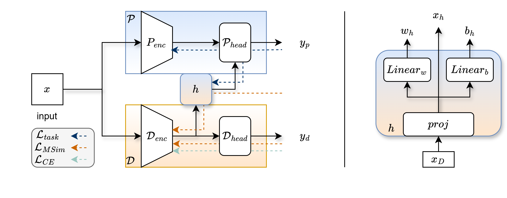

# HyDA: Hypernetworks for Test Time Domain Adaptation in Medical Imaging Analysis

This repository contains the official implementation of the MICCAI 2025 paper: "HyDA: Hypernetworks for Test Time Domain Adaptation in Medical Imaging Analysis".


<p align="center">
  <a href='https://doi.org/10.1007/978-3-032-04971-1_24' style='padding-left: 0.5rem;'>
    
  </a>
  <a href='https://arxiv.org/abs/2503.04979' style='padding-left: 0.5rem;'>
    
  </a>
  <a href='https://doronser.github.io/hyda-project-page/' style='padding-left: 0.5rem;'>
    
  </a>
</p>
<p align="center">
  
</p>

## General Architecture

HyDA is a hypernetwork-based framework designed to perform unsupervised domain adaptation for medical images. The framework consists of three main components:

1. **Main Network**: Performs the actual task (e.g., classification, regression) using the weights generated by the hypernetwork.
2. **Domain Network**: Learns domain-specific features to help the hypernetwork generate task-specific weights.
3. **Hypernetwork**: Generates weights for the main network based on implicit domain features.

The architecture is designed to handle different medical imaging tasks, including brain MRI age prediction and chest X-ray pathology classification.

## Installation

```bash
# Clone the repository
git clone https://github.com/doronser/hyda.git
cd hyda

# Create a conda environment
conda create -n hyda python=3.10
conda activate hyda

# Install requirements
pip install -r requirements.txt
```

## Implementation Overview

The implementation uses PyTorch Lightning for modular design and YAML configs with CLI overrides. The core modules are written in pure PyTorch, wrapped in Lightning modules for training logic.

Directory structure:
```
HyDA/
├── brain_mri/          # Brain MRI age prediction experiment
│   ├── configs/        # Experiment configurations
│   ├── data/          # Data loading and preprocessing
│   ├── models/        # Neural network models
│   └── pl_modules/    # Lightning modules
├── chest_xray/        # Chest X-ray classification experiment
│   ├── configs/
│   ├── data/
│   ├── models/
│   └── pl_modules/
└── hyda/              # Core HyDA implementation
    ├── layers.py      # Hypernetwork layers
    └── utils.py       # Utility functions
```

## Key Components

### Hypernetwork Layers

The `hyda/layers.py` module implements the core hypernetwork functionality:

- `HyperLinearBMM`: Generates weights for linear layers using batch matrix multiplication
- `HyperGroupedConv`: Generates weights for convolutional layers with grouped convolutions

## Experiments

### 1. Chest X-ray Classification

Train models for pathology classification using different X-ray datasets:

```bash
# Train baseline CheXpert model
python train.py fit -c brain_mri/configs/baseline.yaml \
    --data.init_args.target_domain CheXpert \


# Train domain classifier for CheXpert
python train.py fit -c chest_xray/configs/domain_clf.yaml \
    --data.init_args.target_domain CheXpert \
    --model.init_args.target_domain CheXpert

# Train HyDA CheXpert model
python train.py fit -c chest_xray/configs/hyper.yaml \
    --data.init_args.target_domain CheXpert \
    --model.init_args.target_domain CheXpert \
    --model.init_args.dom_clf_ckpt <domain_classifier_checkpoint>
```


### 2. Brain MRI Age Prediction
While the brain age data is mostly publicly available, the full pipeline for preprocessing and training is beyond the scope of this repository. Below are examples of how to train the models, given the data is prepared.

Train models on brain MRI scans for age prediction across different domains:

```bash
# Train baseline model
python train.py fit -c brain_mri/configs/baseline.yaml \
    --data.init_args.target_domain <target_domain> \
    --trainer.default_root_dir outputs/brain_age_baseline

# Train HyDA model
python train.py fit -c brain_mri/configs/hyda.yaml \
    --data.target_domain <target_domain> \
    --trainer.default_root_dir outputs/brain_age_hyda
```

## Citation

If you find this work useful, please cite our paper:

```bibtex
@InProceedings{SerDor_HyDA_MICCAI2025,
        author = { Serebro, Doron AND Riklin-Raviv, Tammy},
        title = { { HyDA: Hypernetworks for Test Time Domain Adaptation in Medical Imaging Analysis } },
        booktitle = {proceedings of Medical Image Computing and Computer Assisted Intervention -- MICCAI 2025},
        year = {2025},
        publisher = {Springer Nature Switzerland},
        volume = {LNCS 15964},
        month = {September},
        page = {251 -- 261}
}
```

## License

This project is licensed under the MIT License - see the [LICENSE](LICENSE) file for details.
